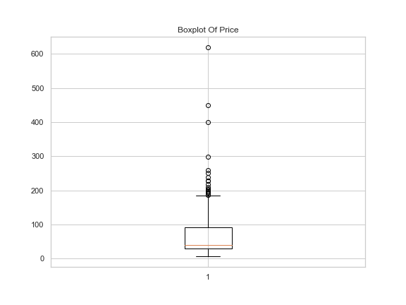
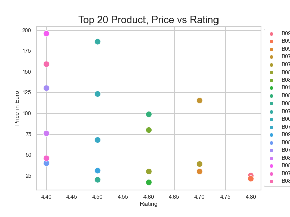

# Amazon Product Analysis

<h2>Web Scraping</h2>
- libraries: request, BeautifulSoup, pandas 
- function <a href = 'https://github.com/n-hien/Amazon-Product-Analysis/blob/main/earbudsScraper.py'> get_data </a> is used to get the data from each page, and append it to dataFrame 
- then, loop through all pages and save dataset in .csv file
<h2>Product Price Analysis</h2>
- Firstly, duplicates in the "Asin" column will be removed  
- Then,the datatypes of price, Rating and Number of Rating will be converted to numeric for analysis purpose 
- Using dataFrame.describe() and boxplot to see the distribution of product price

  

- Filter the top 20 products based on Rating and draw a scatter plot of these top 20 products

  

- We maybe want to buy the product with Asin is B09J8HTDHX

<h2>Product Review Analysis</h2>
- function <a href='https://github.com/n-hien/Amazon-Product-Analysis/blob/main/ReviewScraper.ipynb'> get_review</a> is used to get all reviews of products  

